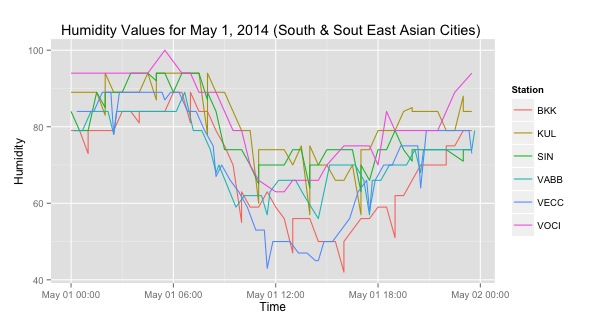

###Example showing How to Get Detailed Data for Specific Columns

Let's say that we are interested seeing how the humidity levels vary within one day for a few South East and South Asian cities.

For this example, we don't want summarized data. We want many readings per day, and hence detailed data. Also, we are interested in "Humidity" values, not the default Temperature columns.	So we have to use custom_columns
	
####Usage: getWeatherForDate("station_id", "YYYY", opt_detailed=T,  opt_custom_columns=T)	

    library(weatherData)

Let's say that we are interested in six cities: Mumbai, Cochin, Kolkata, Bangkok, Kuala Lumpur and Singapore. These are all high humidity cities. First, we need to find the station_id's for each city. (If we know the three letter airport code (say 'BKK') we could use those.

####Figure out the parameters needed

For the ones we don't know, the `getStationCode` function could be of help. We are looking for the 4 letter code.

	> getStationCode("Calcutta") #VECC
		[1] "INDIA    CALCUTTA/DUM DUM VECC        42809  22 39N  088 26E    6   X     T          6 IN"
			
So we know we should use `VECC` for Kolkata.

    getStationCode("Cochin") #VOCI
    getStationCode("Bombay") #VABB

So now we can build our cities vector.

    cities_to_compare <- c("VECC", "SIN", "KUL", "VABB", "VOCI", "BKK")

But which column has the humidity value? There is a function for that. We can find out using `showAvailableColumns()`

     > showAvailableColumns("VOCI", "2014-05-01", opt_detailed=T)
       columnNumber           columnName
    1             1              TimeIST
    2             2         TemperatureF
    3             3           Dew_PointF
    4             4             Humidity
    5             5 Sea_Level_PressureIn
    6             6        VisibilityMPH
    7             7       Wind_Direction
    8             8        Wind_SpeedMPH
    9             9        Gust_SpeedMPH
    10           10      PrecipitationIn
    11           11               Events
    12           12           Conditions
    13           13       WindDirDegrees
    14           14              DateUTC

The humdity column is the 4th column. When we use custom_colums, we have to give it that number. Now, we are ready to fetch the required data for all six cities. Let's write a simple function to help us keep everything ordered. Another reason to write this function is that now we can involve `plyr::ldply` which will stack things for us nicely into one super-data-frame.

####Fetch the Data

    getHumidity <- function (city_code, date_string) {
      hdf <- getWeatherForDate(city_code, date_string, 
                        opt_detailed=TRUE,
                        opt_custom_columns=T, custom_columns=4)
      #add one column that helps identify the city.
      # This is needed so that city name is retained 
	  # when we stack data frames vertically
      hdf$Station <- city_code
      return(hdf)
    }

    library(plyr)
    humidity_df <- ldply(cities_to_compare, getHumidity, "2014-05-01")
    > dim(humidity_df)
	[1] 309   3

Now we have the data we need. We can carry out any analysis we wish, or plot the data.

####Plot it
    ggplot(humidity_df, aes(x=Time, y=Humidity)) + 
	  geom_line(aes(color=Station)) +
      labs(title="Humidity Values for May 1, 
	       2014 (South & South East Asian Cities) ")

And here's the resulting plot:

	
[<< Back to Examples](index.html#moreexamples)

