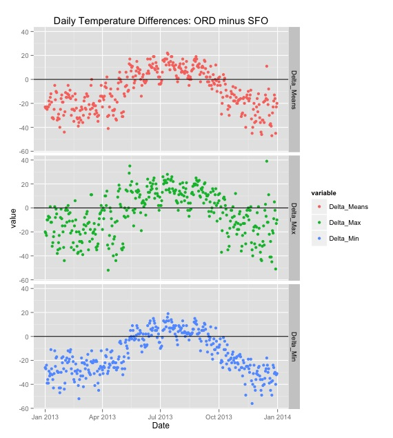

###Example showing the use of getWeatherForYear()

    library(weatherData)
	
	
####Usage: getWeatherForYear("station_id", "YYYY")	
	
First, we get two data frames, with one year's worth of temperature data in each. (365 rows each.) Note that `getWeatherForYear` is a function in the `weatherData` package.

    city1 <- "ORD"
    city2 <- "SFO"
    df1 <- getWeatherForYear(city1, 2013)
    df2 <- getWeatherForYear(city2, 2013)
	
	
Given two dataframes that contain daily temperatures (mean, min and max), we are simply taking the vectorized differences and creating another data frame.	
	
    getDailyDifferences <- function(df1, df2){
      Delta_Means <- df1$Mean_TemperatureF - df2$Mean_TemperatureF
      Delta_Max <- df1$Max_TemperatureF - df2$Max_TemperatureF
      Delta_Min <- df1$Min_TemperatureF - df2$Min_TemperatureF
  
      diff_df <- data.frame(Date=df1$Date, Delta_Means, Delta_Max, Delta_Min)
      return(diff_df)
    }

Next, let's write a small function using `ggplot` to plot the daily differences. We will use 3 facets, one each for Mean, Max and Min difference.

    plotDifferences <- function (differences, city1, city2) {
      library(reshape2)
      m.diff <- melt(differences, id.vars=c("Date"))
      p <- ggplot(m.diff, aes(x=Date, y=value)) + geom_point(aes(color=variable)) +  
        facet_grid(variable ~ .) +geom_hline(yintercept=0)
      p <- p + labs(title=paste0("Daily Temperature Differences: ", city1, " minus ",city2))
      print(p)
    }

With these two functions in place, given any two cities, we can create the difference data frame and plot the differences. Let's try it for Chicago and San Francisco.

    differences<- getDailyDifferences(df1, df2)
    plotDifferences(differences, city1, city2)

And here's the resulting plot:

	
[<< Back to Examples](index.html#moreexamples)

